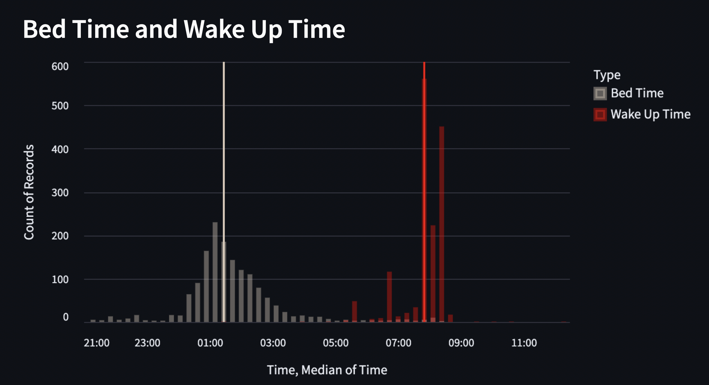
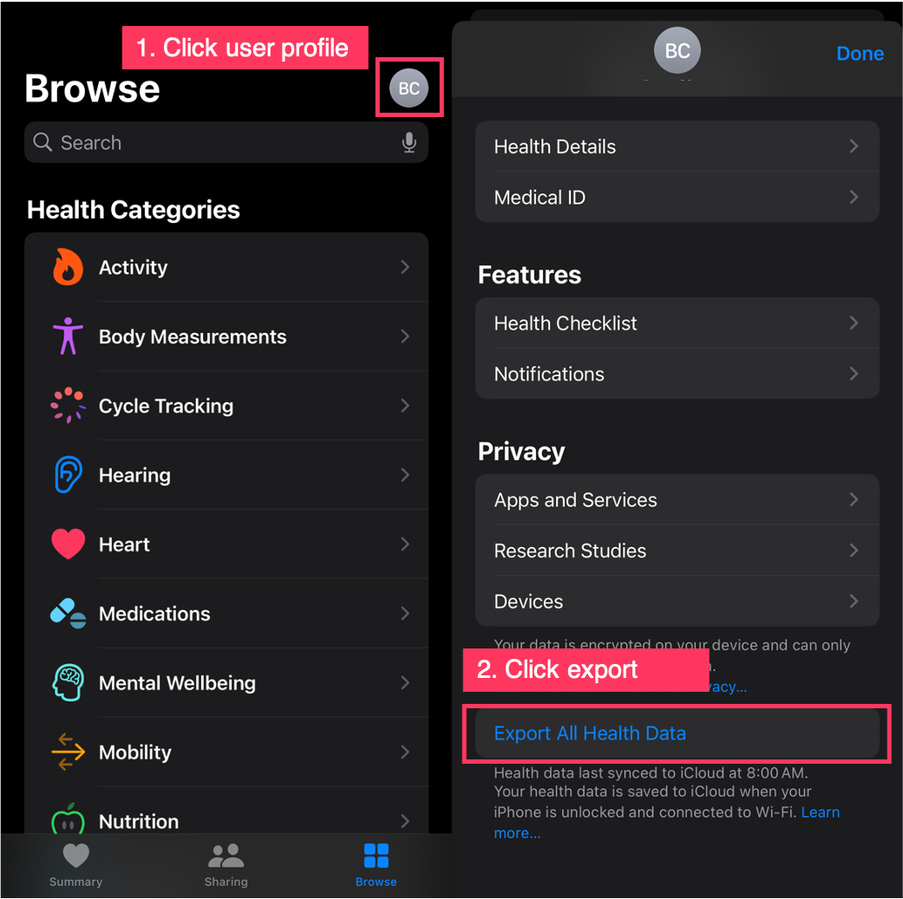
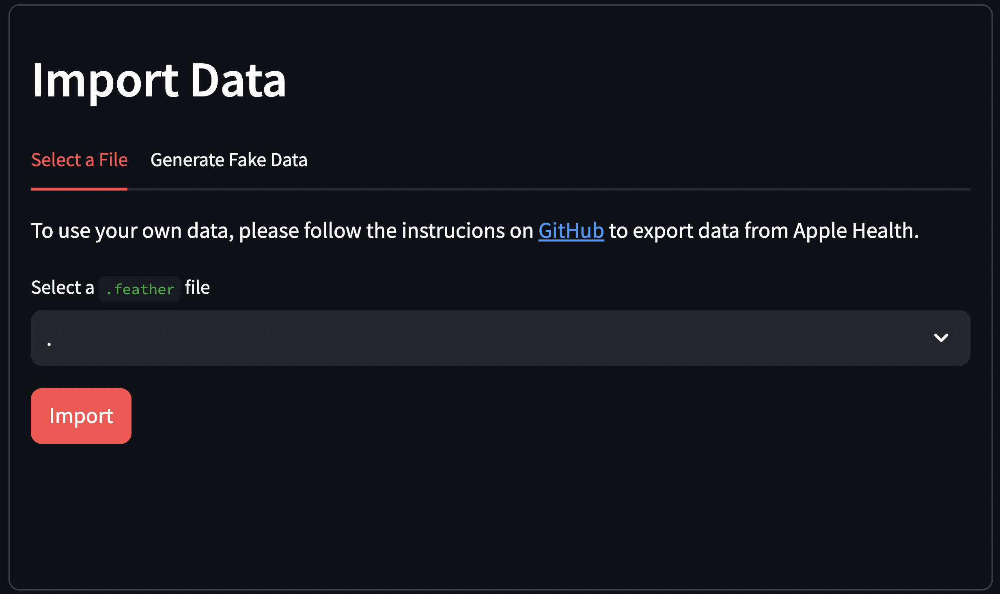

# Apple Health Visualization (streamlit + altair)
This application visualizes your Apple Health data with ease. Unlike the built-in iOS app, it allows you to effortlessly select and explore your desired time range.

To protect your privacy, your Apple Health data is utilized locally. Otherwise, we perform simulated data generation. (ignore step 2.)

Start using demo:




## Quick Start

1. Install package (poetry)
    ```
    poetry install
    ```
2. (Optional) Export your data from Apple Health app
    1. Open your Apple Health / Click user profile / Export 
    
    2. Run the script to export a `.feather` file
    ```
    # poetry run python -m apple_health_exporter [exported zip file from Health] [.feather file name]

    poetry run python -m apple_health_exporter export.zip export.feather
    ```
3. Run Streamlit
   ```
   poetry run streamlit run run.py
   ```

  
Import data or use fake data and start!


## Known Issues
1. Data export from Apple Health has a bug under iOS in [16, 16.2). This bug has been fixed by Apple after iOS 16.2, so update your iOS first.
2. Apple doesn't handle time zone and daylight savings well. Therefore, if your sleeps cross different regions, the records may be incorrect.


## Contact
- [GitHub](https://github.com/boboru/apple-health-visualization)
- [Blog](https://boboru.net/) 